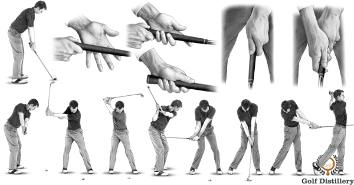
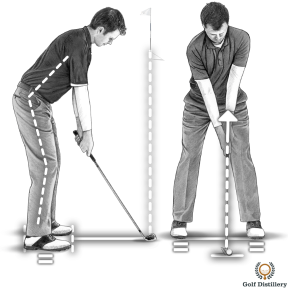
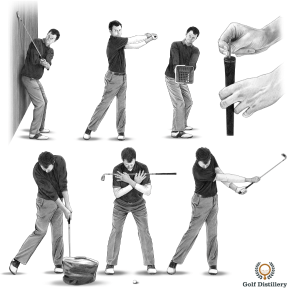
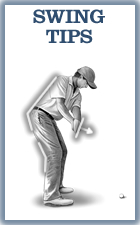
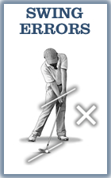
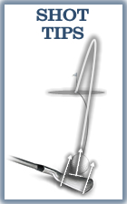
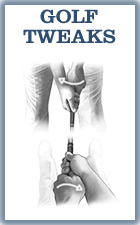
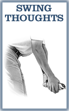
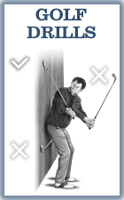
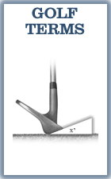

# Golf Tips

## Golf Tips - Step-by-Step Golf Lessons

Step-by-step instructional golf lessons and videos based on proven fundamentals and on Pete Styles' expertise as a PGA Teaching Professional to help you play better golf… consistently better golf.

---

## Golf Tips for Beginners

If you are new to golf, you will probably want to start with the beginner golf tips section of Golf Distillery which breaks down the relatively complex golf game into the core elements you should be focusing on.

You might also want to take a look at the Top 10 Golf Tips for Beginners section which highlights the most important areas you should focus on in order to rapidly bring down your scores.

---

## Golf Setup

Unlike many other sports, golf has the advantage of seeing the ball remain stationary before you are allowed to hit it. This provides you with a unique opportunity to carefully position your body before hitting it.

The golf setup section of Golf Distillery covers the following areas: alignment, stance, distance to the ball, ball position, hand position, posture and the grip.

---

## Golf Swing

After the setup, golfers next move through the various sequences in the golf swing. The golf swing section covers the following sequences: the takeaway, the backswing, the top of the swing, the downswing, impact, extension & rotation and the follow through.

---

## Golf Swing Drills

Golf swing drills specifically target a specific issue that you may be experiencing in your golf swing. Drills provide you with an opportunity to practice that specific element of the swing in order to master it.

---

## Navigation Sections

### 
Swing Tips

### 
Swing Errors

### 
Shot Tips

### 
Shot Errors

### 
Golf Tweaks

### 
Swing Thoughts

### 
Golf Drills

### 
Golf Terms
