# Swing Drills

## Golf Drills for Every Part of your Golf Swing

Now you've been through the golf swing tips section, let's put that into practice with these drills.

---

## Takeaway Drills

### Golf Takeaway Drill #1 - Passive Hands

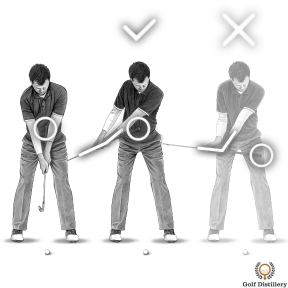

Here's a great little drill if you're struggling to get the feeling of a one-piece takeaway in your golf swing.

### Golf Takeaway Drill #2 - Ball Bucket

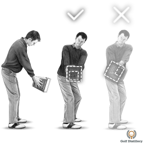

Here's another very simple but very useful golf drill to help you with the one-piece takeaway.

---

## Backswing Drills

### Halfway Back Drill #1

This excellent golf backswing drill is simple but very informative. It will help you get a feel for your swing path and whether you're swinging the club on too flat or too steep a plane.

### Halfway Back Drill #2

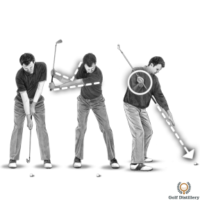

Another nice backswing drill will help you set the club in a nice position halfway back.

---

## Top of the Backswing Drills

### Top of Backswing Drill #1 - Proper Upper Body Rotation

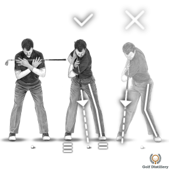

This simple drill will show you if your shoulders are turning correctly through to the completion of the backswing.

### Top of Back Swing Drill #2 - Correct Position of the Club

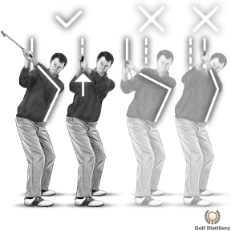

This second drill is more of a checkpoint to help you assess your swing plane and path during the backswing.

### Top of Back Swing Drill #3 - Correct Direction of the Club

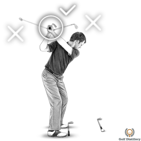

This drill will help you to achieve the correct position at the top of the backswing by focusing on your left thumb.

### Top of Back Swing Drill #4 - Right Hand Position

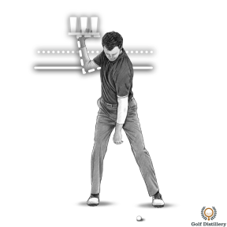

In this drill, I show you how to envisage the correct position of your right hand at the top of the backswing.

---

## Transition Drills

### Transition Drill #1 - Correct Weight Transfer

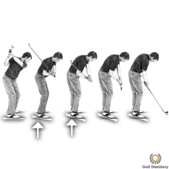

This downswing drill will help you with the transitional part of your golf swing.

### Transition Drill #2 - Keeping the Lag

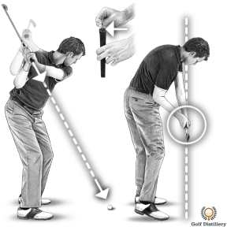

This quick and simple downswing drill will help you to bring the club down into the ball on the right path.

### Transition Drill #3 - Right Elbow Position

This simple downswing drill will help to ensure your swing is on a good path and plane.

---

## Impact Drills

### Impact Drill #1 - Weight Transfer

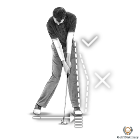

One of the key positions that you can try and help yourself get into at impact, is a strong left side (for the right-handed golfer).

### Impact Drills #2 and #3 - Impact Bag Exercises

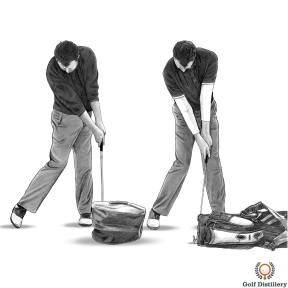

These two golf impact drills will help you to feel the sensations of a solid impact position.

---

## Extension and Rotation Drills

### Extension & Rotation Drill #1

This drill will help you with correct arm rotation through the golf ball.

### Extension & Rotation Drill #2

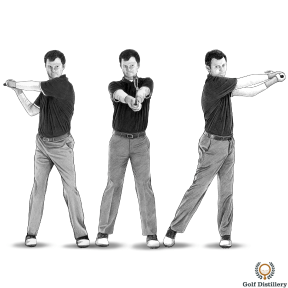

Here's another drill to help you achieve correct arm and hand rotation through the golf ball.

---

## Follow Through Drill

### Follow Through Drill #1

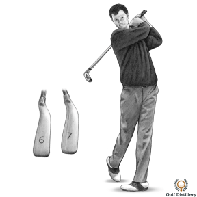

Here's a simple drill to help you with a fluid, balanced follow through.
