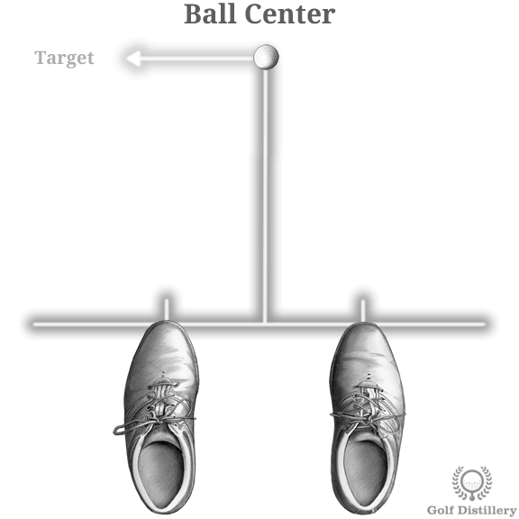

# Ball in the Center of Stance

## Definition

Ball center position represents the neutral starting point where the ball is located the same distance from the left foot as it is to the right foot. This is the default ball position for many standard golf shots.

## How to Position Ball in Center

To establish center ball position:

1. **Set your stance width** - First establish your normal stance width for the club you're using
2. **Find the midpoint** - Locate the exact center point between your two feet
3. **Place ball at midpoint** - Position the ball equidistant from both feet

The result is a neutral ball position that provides a balanced starting point for club-to-ball contact.

## Characteristics of Center Ball Position

### Neutral Loft Angle

With the ball centered in your stance:
- The club's loft is at a neutral angle
- Neither added nor reduced loft at impact
- Standard trajectory for the club
- Contact occurs at a balanced point in the swing arc

### Standard Swing Arc Point

Center ball position means:
- Club contacts ball at a neutral point in the downswing
- Neither early nor late in the arc
- Balanced weight distribution at impact
- Natural club path through the ball

## Ball Flight Characteristics

With center ball position, expect:
- **Standard trajectory**: Ball flies at a neutral height
- **Neutral loft**: Club performs with its designed characteristics
- **Balanced contact**: Even strike pattern
- **Consistent results**: Repeatable ball flight
- **Versatile positioning**: Works for many club types

## When to Use Center Ball Position

Center ball position is appropriate for:
- **Short to mid irons**: 7-iron through 9-iron typically use center or slightly forward
- **Punch shots**: When you want a controlled, penetrating trajectory
- **Standard conditions**: Default position for many approach shots
- **Learning fundamentals**: Good starting point for developing consistent contact
- **Neutral shot shape**: When no special trajectory adjustments needed

## Common Clubs for Center Position

### Mid Irons
- 6-iron
- 7-iron
- 8-iron
- Often played from center or slightly forward of center

### Short Irons
- 9-iron
- Pitching wedge
- Can be played from center for standard shots

### Specialty Shots
- Punch shots with any club
- Knockdown shots
- Controlled trajectory shots
- Bump-and-run chips

## Comparison to Ball Back Position

Unlike ball back position which:
- Decreases loft significantly
- Produces lower trajectory
- Increases risk of topped shots
- Contact very early in downswing

Center position:
- Maintains neutral loft
- Produces standard trajectory
- Balanced contact point
- Neutral swing arc position

## Comparison to Ball Forward Position

Unlike ball forward position which:
- Increases loft significantly
- Produces higher trajectory
- Increases risk of fat shots
- Contact later in downswing

Center position:
- Maintains neutral loft
- Produces standard trajectory
- Balanced contact point
- Neutral swing arc position

## Adjustments from Center

### Moving Forward (Toward Target)
From center, moving the ball forward will:
- Increase effective loft
- Create higher ball flight
- Contact later in swing arc
- More suitable for longer clubs

### Moving Back (Away from Target)
From center, moving the ball back will:
- Decrease effective loft
- Create lower ball flight
- Contact earlier in swing arc
- More suitable for punch shots

## Key Reminders

1. **Equidistant from both feet** - This is the defining characteristic
2. **Neutral loft angle** - Club performs at standard specifications
3. **Balanced contact point** - Even position in swing arc
4. **Versatile application** - Works for many club types
5. **Good baseline** - Starting point for position adjustments
6. **Standard trajectory** - Predictable, neutral ball flight

## Tips for Finding Center

### Visual Method
- Look down at your feet
- Imagine a line connecting your toes
- Find the midpoint of that line
- Position ball there

### Measurement Method
- Measure distance from ball to left toe
- Measure distance from ball to right toe
- Adjust until distances are equal

### Feel Method
- Set up to the ball naturally
- Check if weight feels evenly distributed
- Ball should feel centered in your vision
- Adjust if you feel off-balance
