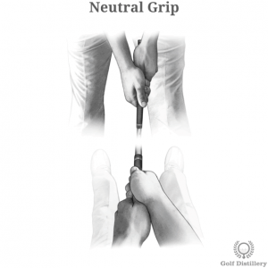

# Strong Grip

The way fingers are positioned on the actual grip of the club has an immense impact on the path the club will take around your body and ultimately the direction and flight of the golf ball. While its effects are often overlooked in favour of the swing proper, serious golfers should carefully position their hands on the grip of the club before each and every shot and treat that process as an integral part of the golf swing.

Here are several of the grip tweaks available and their corresponding effects.

## Strong Grip

What would be called a strong grip will see both of your hands leaning to the right of your grip (when looking down).

This is in contrast to being more or less in the middle of the shaft.

### How to Place your Fingers

First grip the club with your left hand making sure that when you do and when the clubface is square to the target you can see exactly three knuckles. These would be the top knuckles of your index, middle and ring fingers.

With your left hand in place, position your right hand below it and in such a way that both palms are effectively facing each other from opposite sides of the grip.

If you've done it correctly, the Vs formed by your thumbs and index fingers should be pointing towards your right shoulder.

### What it Promotes

All other things being equal, a strong grip promotes an active release of the hands at impact, meaning that hands are encouraged to fully roll into impact.

This natural ease in releasing favours a clubface that is more closed than otherwise.

And ultimately, a closed clubface at impact will transfer right to left sidespin into the ball, resulting in a ball that will draw or hook.

## Comparing Grip Strengths

For reference, here are the other grip strength variations and their effects:

