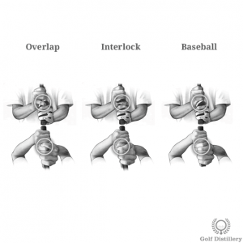
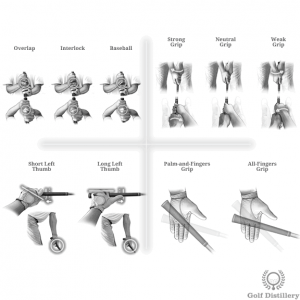

# Weak Grip

The way fingers are positioned on the actual grip of the club has an immense impact on the path the club will take around your body and ultimately the direction and flight of the golf ball. While its effects are often overlooked in favour of the swing proper, serious golfers should carefully position their hands on the grip of the club before each and every shot and treat that process as an integral part of the golf swing.

Here are several of the grip tweaks available and their corresponding effects.

## Definition and Overview

A weak grip is one where both hands are positioned to the left of the center of the grip slightly, when looking down. Or at least left of the center of what would be a normal, neutral grip.

## How to Achieve a Weak Grip

First grip the club with your left hand while making sure that when you do and when the clubface is square to the target only one knuckle is visible when looking down. The knuckle in question would be the one from your index finger.

With your left hand securely in place, position your right hand below it in such a way that it is opposite your left hand. Indeed, both hands should more or less face each other, a statement that is true for all grip strengths.

If you've done it correctly, the Vs formed by your thumbs and index fingers should be pointing towards your left shoulder.

## Effects and Ball Flight

All other things being equal, a weak grip promotes a lazy release of the hands at impact, meaning that hands are restricted from fully rolling into impact.

This difficulty in releasing favours a clubface that is more open than otherwise.

And ultimately, an open clubface at impact will transfer left-to-right sidespin onto the ball, resulting in a ball that will fade or slice.

