# Golf Swing Tips - Fully Illustrated

This section provides illustrated swing tips demonstrating how to execute a proper golf swing through its various components.

---

## Setup & Address Tips

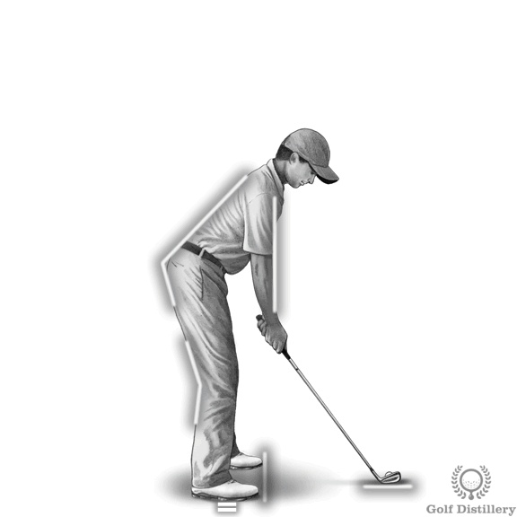
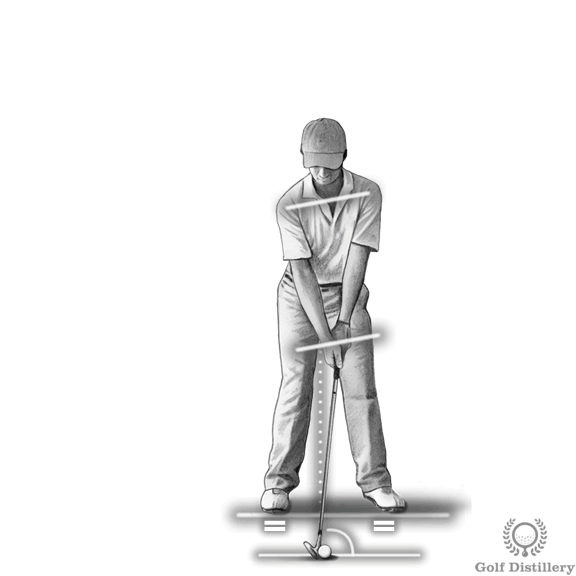

The setup and address position establishes the foundation for the entire golf swing. Key elements include:

- The club should rest flat behind the ball with hands flowing naturally from shoulders
- Knees bent comfortably with upper body tilted forward from the hips
- Weight evenly divided between both feet, primarily on the balls of the feet
- Shaft angled forward slightly with the clubface perpendicular to the target line
- Feet positioned parallel to the target line
- Proper spine angle maintained throughout setup

---

## Takeaway Tips

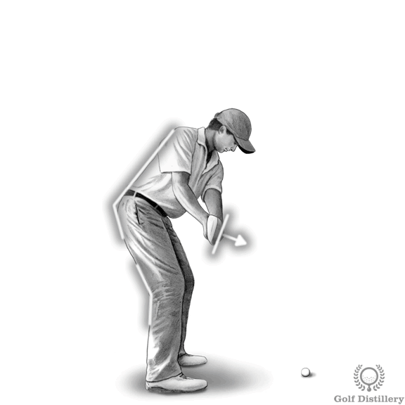
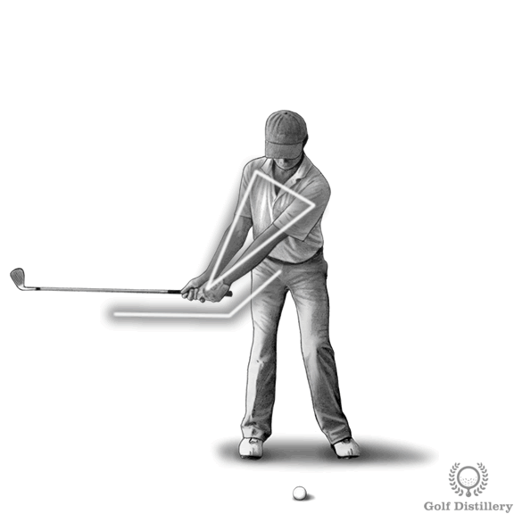

The takeaway begins when the club starts moving back and ends when the shaft reaches parallel to the ground:

- Club should be taken back square to the target line
- When the shaft is parallel to the ground, it should point at the target
- The clubface should point down slightly at this position
- Wrists shouldn't be allowed to hinge this early in the swing
- Arms and shoulders move together as one unit
- Club stays connected to the body rotation

---

## Backswing Tips

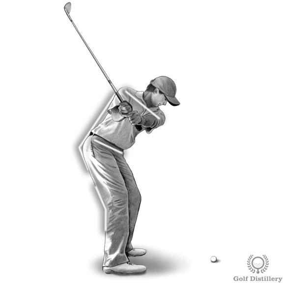
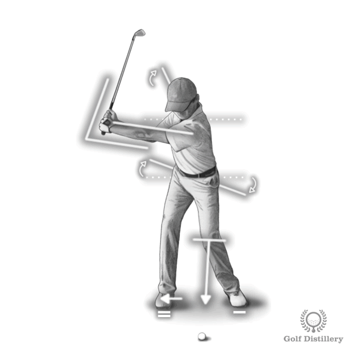

The backswing continues from the takeaway position toward the top of the swing:

- Left arm should remain straight throughout the backswing
- Left heel should remain on the ground (for most golfers)
- Right knee retains its flex from address while left knee points toward the ball
- Head stays in position while weight flows naturally to the right foot
- The backswing process should be slower than the downswing pace
- Shoulders rotate around the spine angle established at address

---

## Top of the Swing Tips

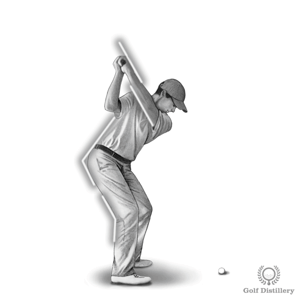
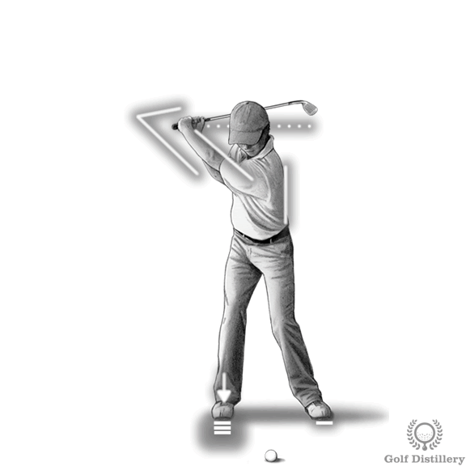

The top of the swing represents the halfway point between address and impact:

- Left wrist should be flat at the top of the swing
- Spine angle should closely resemble the address position
- The shaft should point toward the target, just shy of parallel to the ground
- Back faces the target with wrists fully hinged
- Weight has transferred to the right side
- The swing is momentarily paused before transitioning to the downswing

---

## Downswing Tips

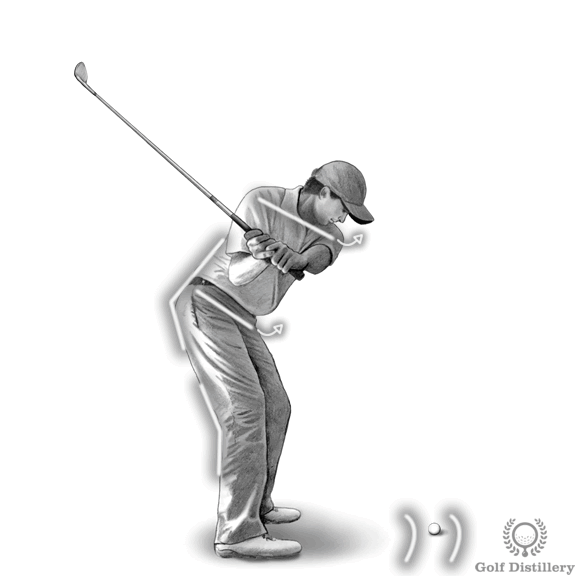
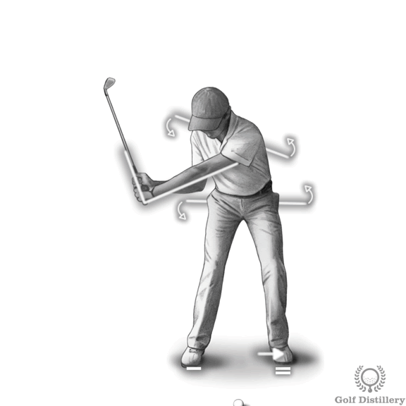

The downswing initiates the movement back toward the ball:

- Hips move first by uncoiling and rotating toward the target
- Weight transitions toward the front left foot
- Wrist hinge is maintained as long as possible (lag)
- Clubhead follows a path that will square it at impact
- The downswing is executed at a noticeably faster pace than the backswing
- Lower body leads while upper body follows

---

## Impact Tips

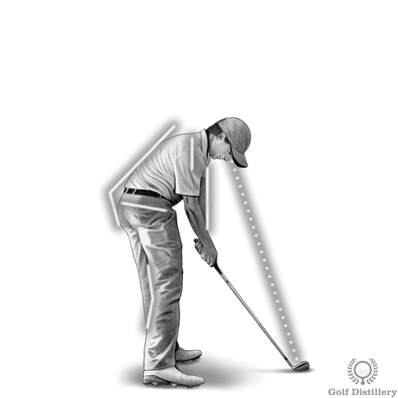
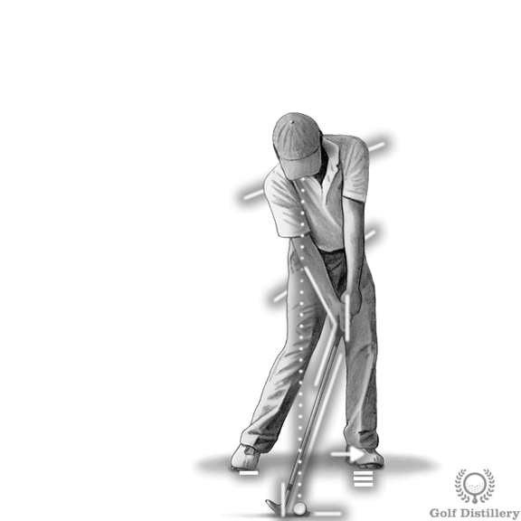

Impact is the only point in time when the body will actually come in contact with the ball:

- Hands should be ahead of the ball at impact
- Spine forward bend should match the address position
- Eyes remain trained on the ball
- Hips and hands are facing toward the target
- Iron shots strike on a downward motion
- Driver and woods strike as the club is rising from its lowest point

---

## Release & Extension Tips

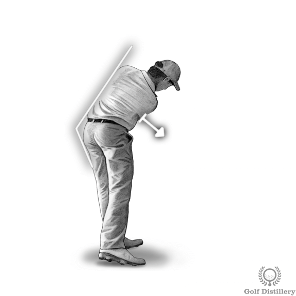
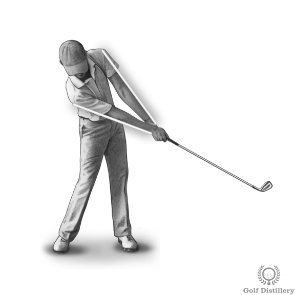

The release occurs immediately after impact with the ball:

- Both arms should be fully extended following impact
- Spine angle remains identical to the impact position
- Forearms and hands begin to roll naturally
- Bottom hand (right for right-handed golfers) leads through the release
- Club continues accelerating through the ball
- Arms extend toward the target

---

## Follow Through Tips

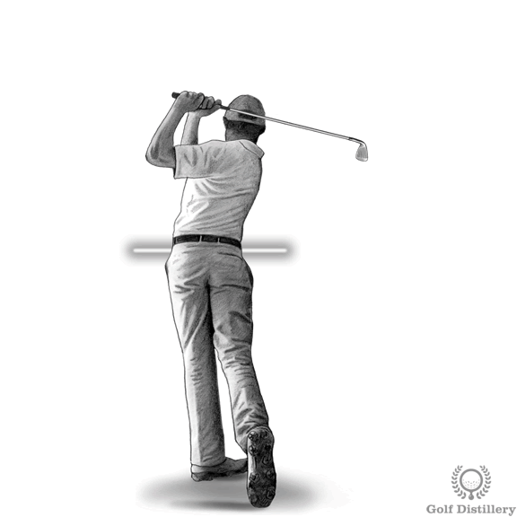
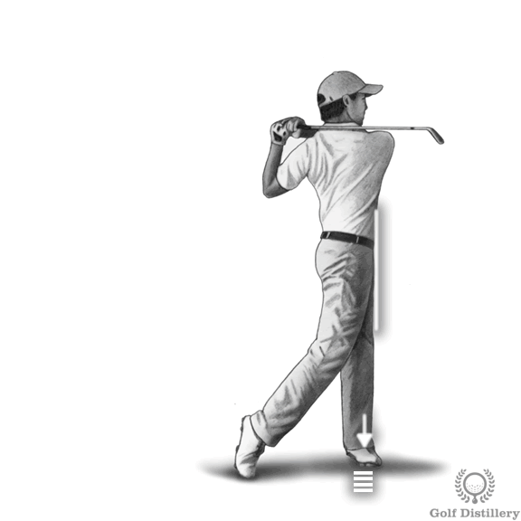

The follow through position after ball contact indicates the quality of previous motions:

- Hands release naturally after the wrists unhinge
- Hands and clubhead circle around the body
- Weight has moved to the left foot (for right-handed golfers)
- Hips are facing the target
- Resist the urge to quit swinging after the club has hit the ball
- Body finishes in a balanced position facing the target
- Chest faces the target at completion

---

## How to Hit Your Driver

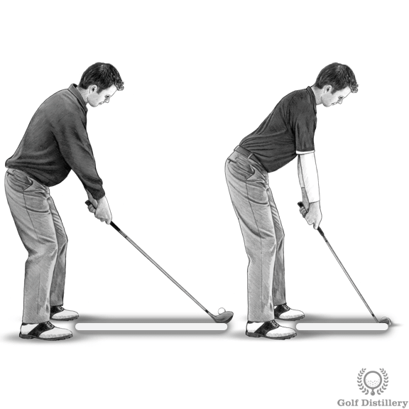

Driver technique differs from iron shots in several key aspects:

### Ball Position
- Ball positioned further forward in the stance (at the instep of the front foot)
- Ball located further from the body due to the longer shaft length

### Setup Adjustments
- Hands address the ball with a forward position
- Spine tilted back slightly (away from target) at address
- More than half of body weight remains on the back foot at setup

### Swing Characteristics
- Swing plane should be flatter compared to wedge shots
- Driver should strike the ball as the club is rising from its lowest point
- Contact occurs on the upswing rather than the downswing
- Promotes optimal launch angle and reduced spin for maximum distance

---

*Source: Golf Distillery - https://www.golfdistillery.com/swing-tips/*
