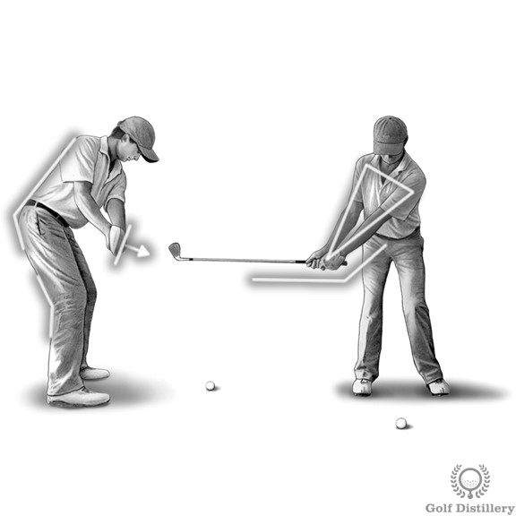
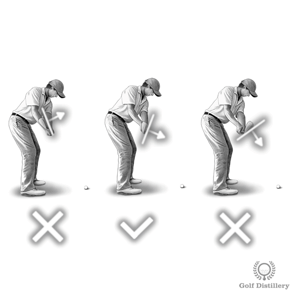
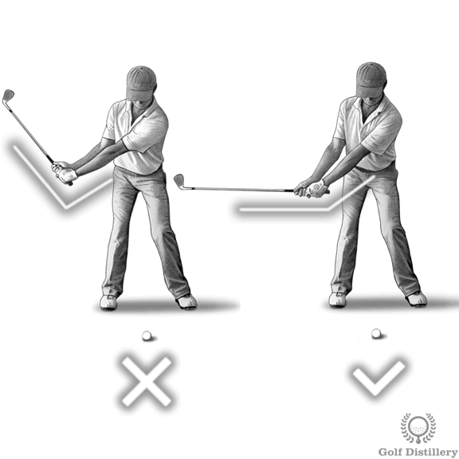

# Golf Takeaway - How to Correctly Begin your Golf Swing at the Takeaway

The way you start your golf swing through the takeaway will have consequences on every swing sequence that follows.

## Key Takeaway Checkpoints

### 1. Shaft Position During Takeaway

The club should be brought back in line with the target line. Specifically, this means that when the shaft of the club is parallel to the ground the club should be pointing straight ahead.

### 2. Clubface Angle

The leading edge of the club should tend to point towards the ground slightly, towards the ball rather than pointing upward (open) or at too steep an angle (closed).

### 3. Wrist Hinge

The shaft of the club reach the position where it is parallel to the ground through the hands moving away from the front of your body via shoulder rotation.

### 4. Hand Position (Triangle Formation)

During the takeaway this triangle is to be kept intact with hands remaining in front of the chest through upper body rotation.

---

## Related Resources

**Takeaway Drills:** https://www.golfdistillery.com/drills/takeaway-drills/

**Club Position Details:** https://www.golfdistillery.com/swing-tips/takeaway/club-position/

**Clubface Direction:** https://www.golfdistillery.com/swing-tips/takeaway/clubface-direction/
