# Swing Errors

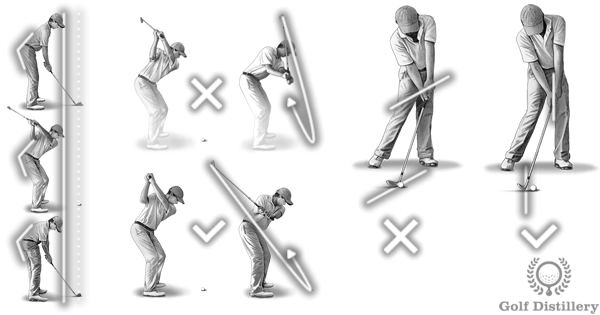

Swing errors are specific mistakes that are made in the course of a live golf swing, when the club is moving. This is in contrast to an address & setup error that deals with mistakes made prior to beginning a golf swing, while the golfer is positioning himself ahead of a shot.

This section explores the different swing errors that golfers can make. The causes behind the swing errors are covered, as well as tips on how to fix them.

---

## 1. Laid-Off

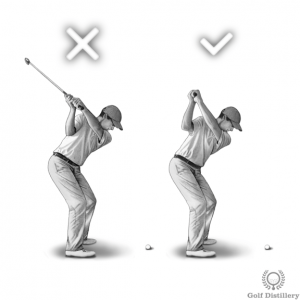

Swing errors often come in pairs. In this instance, the laid-off top of the swing…

---

## 2. Across the Line

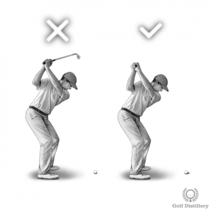

This swing error is visible at the top of the golf swing. It involves bringing…

---

## 3. Off-Balance Swing

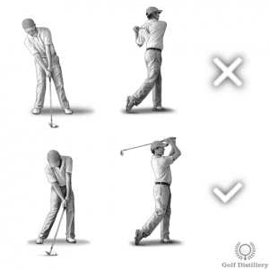

There are many different golf swings out there, some quicker than others and some…

---

## 4. Short Swing

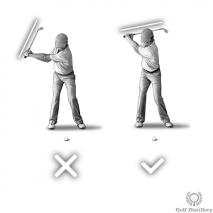

A lot is said about an over swing and its negative impacts on your…

---

## 5. Over Swing

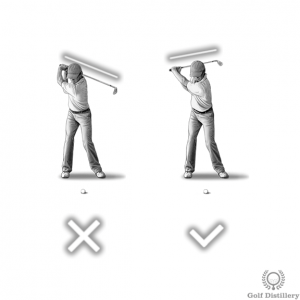

Golfers who struggle with an over swing often don't know it. That is because…

---

## 6. Outside Takeaway

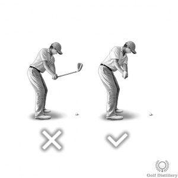

Taking the club up correctly during the first phase of the golf swing –…

---

## 7. Inside Takeaway

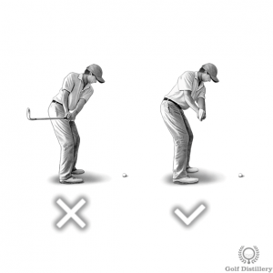

Adopting a great setup and address position goes a long way in helping you perform…

---

## 8. Over the Top

An over the top swing is one that features a downswing in which the…

---

## 9. Casting

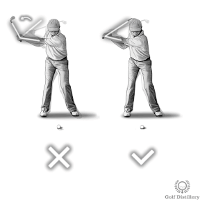

In addition to being a fishing term, casting is a golf swing error that…

---

## 10. All Arms Swing

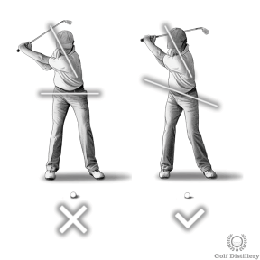

A golf swing said to be an 'all arms' swing is one that features…

---

## 11. Swaying (Sway)

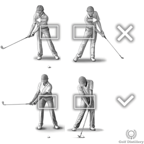

Swaying is the swing error that features hips that are moving laterally during the…

---

## 12. Reverse Pivot

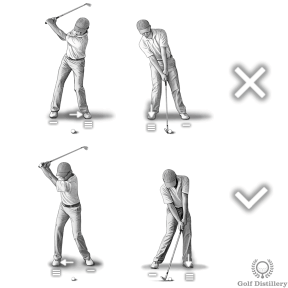

A golfer with a reverse pivot swing will move his body weight during his…

---

## 13. Blocking Shots

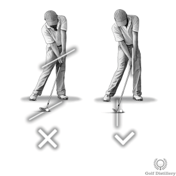

Blocked golf shots are shots that shoot straight right when hit by right handed…

---

## 14. Scooping the Ball

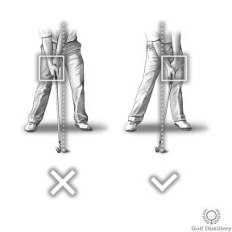

Scooping the ball – or flipping the club – occurs when you try to…

---

## 15. Locking Your Right Knee

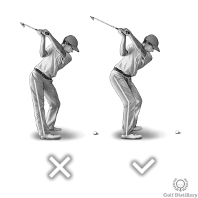

As the name of the golf swing error implies, locking up the back knee…

---

## 16. Locking Your Left Knee at Impact

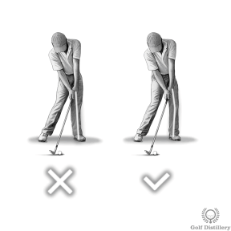

As the name implies, locking up the front knee…

---

## 17. Standing Up at Impact

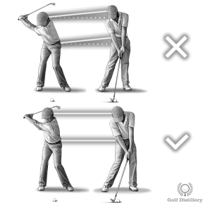

Standing up at impact involves changing the forward spine angle…

---

## 18. Decel

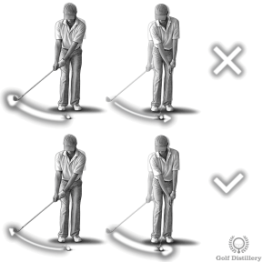

A golf swing that is decelerating – or of the decel variety…

---

## 19. Failing to Maintain Your Spine Angle

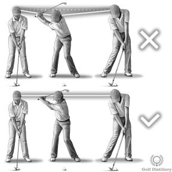

The failing to maintain your spine angle swing error is just that. It is…

---

## 20. Yips

A keen golfer suffering from the yips will lead a most miserable life for…
