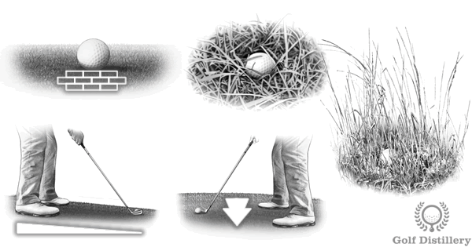

# Golf Shot Tips - How to Hit Any Shot

## How to Hit Any Golf Shot

---

## Shot Shaping

### How to Shape the Ball Flight of your Golf Shots

Use this section for tips on how to shape the ball flight of your golf shots. Not all shots need to be straight and some situations call for balls to travel lower, to curl from right to left or to curl from left to right.

**Topics covered:**
- How to hit stingers (low shots)
- How to draw the ball
- How to fade the ball

[View Shot Shaping Guide →](https://www.golfdistillery.com/shot-tips/shot-shaping/)

---

## Difficult Lies

### How to Hit from Difficult Lies

Sure, you're pretty comfortable hitting from the teeing ground or from the fairway, but what about when the lie of your ball isn't perfect?

**Topics covered:**
- Heavy and fluffy rough
- Tall grass/fescue
- Tight lies
- Ball above/below feet
- Uphill and downhill lies

[View Difficult Lies Guide →](https://www.golfdistillery.com/shot-tips/difficult-lies/)

---

## Tree Trouble

### How to Hit Golf Shots from Tree Trouble

Use this section for tips on how to escape tree trouble. Indeed, during a round of a golf it is likely that you will find yourself blocked by trees.

**Topics covered:**
- Punch shots under trees
- Draw and fade punch shots
- High shots over trees

[View Tree Trouble Guide →](https://www.golfdistillery.com/shot-tips/tree-trouble/)

---

## Bunker Shots

### How to Hit Bunker Shots

Review our how-to guides for situations where your golf ball is located inside a sand bunker.

**Topics covered:**
- Regular bunker shots
- Wet or compact sand
- Plugged lies
- Fried-egg lies
- Short and long bunker shots
- Fairway bunker shots
- Upslope and downslope bunker shots

[View Bunker Shots Guide →](https://www.golfdistillery.com/shot-tips/bunker-shots/)

---

## Related Content

- [Swing Tips](https://www.golfdistillery.com/swing-tips/)
- [Swing Errors](https://www.golfdistillery.com/swing-errors/)
- [Shot Errors](https://www.golfdistillery.com/shot-errors/)
- [Golf Tweaks](https://www.golfdistillery.com/tweaks/)
- [Swing Thoughts](https://www.golfdistillery.com/swing-thoughts/)
- [Golf Drills](https://www.golfdistillery.com/drills/)
- [Golf Terms](https://www.golfdistillery.com/definitions/)

---

**Page Information:**
- Published: April 2, 2019
- Last Modified: April 14, 2022
- Source: https://www.golfdistillery.com/shot-tips/
