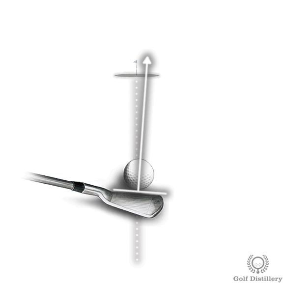
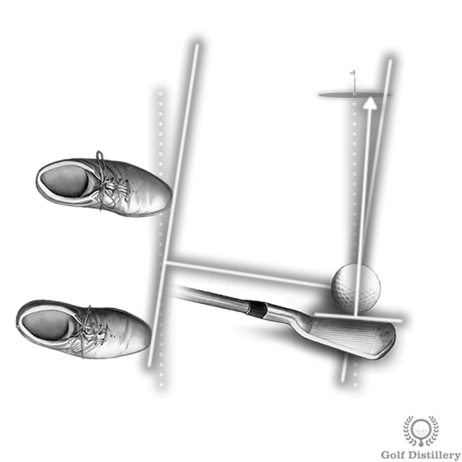
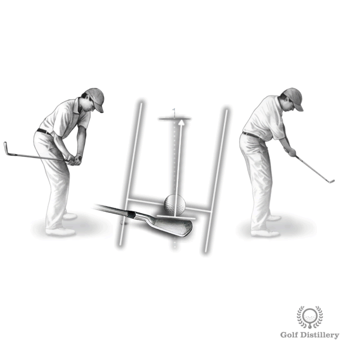
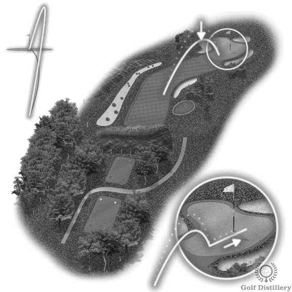
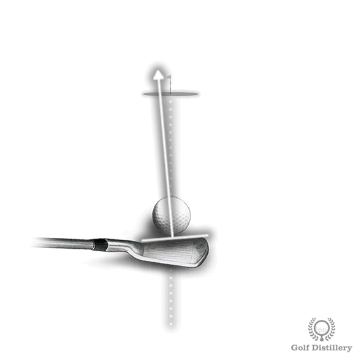
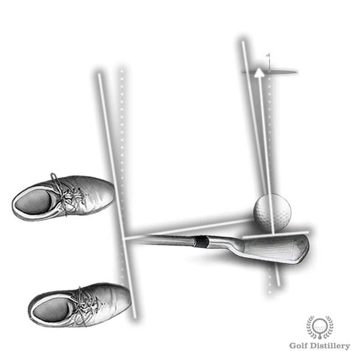
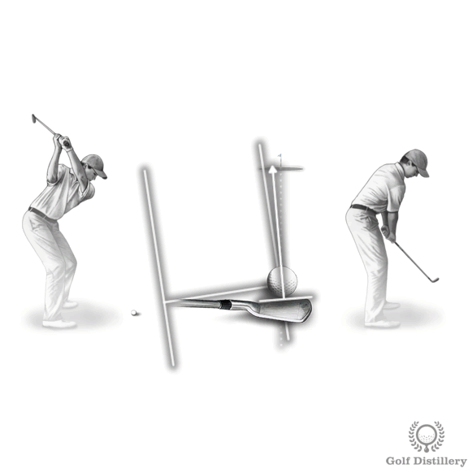
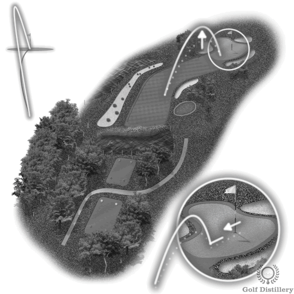
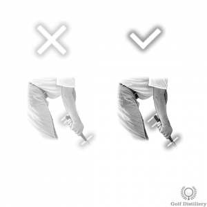
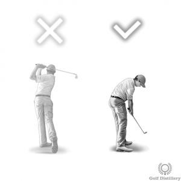

# How to Shape the Ball Flight of your Shots

While golfers typically aim for straight, reliable ball flights, there are instances where you would want the ball to take a different path than your typical straight and high ball flight.

## Three Primary Shot Shapes

---

## 1. How to Hit a Draw

### What is a Draw?

In golf a draw is the name of the trajectory that sees the ball starting outside of the target line after impact but curling in and finishing at the target.

In golf a draw is a ball that shoots to the right of the target initially but curls back while in the air to come to rest at the target. The draw produces a right-to-left ball flight that rolls a little further upon landing.

### Step 1: Open Your Clubface so it Aims Right of Target Slightly

Position the clubface slightly to the right of target, ensuring initial rightward ball direction.

### Step 2: Close Your Stance, so Clubface is Closed to Stance

Rotate feet right of target so the clubface becomes closed relative to the stance line, creating the necessary sidespin.

### Step 3: Swing Along your Feet for an Inside-Out Swing Path

Swing along your body toward the right, maintaining an inside-out club path without correction attempts.

### Step 4: A Draw will Fly Lower and Will Roll More

Draws tend to fly lower than normal straight shots and roll a longer distance upon landing due to reduced effective club loft.

---

## 2. How to Hit a Fade

### What is a Fade?

In golf a fade is the name of the trajectory that sees the ball starting inside of the target line after impact but curling out and finishing at the target.

The fade is the ball flight that sees the ball starting left of the target initially but curling back in the air and coming to rest at the target. This produces a high left-to-right ball flight that lands softly.

For right-handed players, the ball initially shoots left then curves right mid-flight to land on target. This differs from a slice, which is considered an error since the ball misses the target.

### When to Use a Fade

- Managing a natural fade swing pattern
- Curling the ball around obstacles like trees or hazards
- Playing in windy conditions to counteract wind effects
- Attacking certain hole locations for softer landings with rightward roll

### Step 1: Close your Clubface so it Aims Left of Target Slightly

Position the clubface closed relative to target, aiming slightly left to encourage a leftward ball start.

### Step 2: Open your Stance, so Clubface is Open to Stance

Rotate your stance open until the clubface sits open relative to your stance positioning, creating the desired misalignment that produces counter-clockwise spin.

### Step 3: Swing Along your Feet for an Outside-In Swing Path

Follow your body alignment without compensating. Let your setup dictate the flight path, producing the outside-in swing that creates left-to-right spin.

### Step 4: A Fade will Fly Higher and Will Roll Less

Anticipate higher trajectory with reduced roll upon landing due to added effective loft from your open clubface positioning.

---

## 3. How to Hit a Low Shot (Punch, Stinger)

### What is a Low Shot?

A stinger is a shot that produces a low ball flight relative to what would normally be produced with the club in hand. The ball climbing slowly into the air, staying relatively close to the ground.

These shots travel lower than normal ball flights and are useful for navigating under tree branches or dealing with strong headwinds. A stinger is often played in order to negate the effect of strong wind.

### Step 1: Use More Club to Reduce Loft

If you want the ball to travel lower than it normally would then the first step is to club up. Longer clubs have less loft, naturally producing lower trajectories.

### Step 2: Narrow Your Stance

A narrow stance will help you gain more control over the ball. This adjustment sacrifices distance for precision, offsetting the yardage gained from clubbing up.

### Step 3: Position Ball Back of Center

Place the ball just back of center in your stance. This promotes reduced effective loft and strikes near the ball's equator rather than underneath it.

### Step 4: Choke Down on Club

Gripping lower on the shaft brings you closer to the ball, enhancing control over the delicate shot.

### Step 5: Open Your Stance Slightly

Open your stance slightly, which should help put that clubface square at impact with the ball. This compensates for the club face being open due to earlier ball contact.

### Step 6: Move Weight Toward Front Foot

Forward weight distribution promotes cleaner strikes and reduces effective club loft at impact.

### Step 7: Keep Hands Ahead at Impact

Pressing your hands forward at address and keeping the lag in your wrists are keys to proper execution.

### Step 8: Hold Follow Through

Restrain your follow-through to maintain forward hand position throughout the swing completion.

### Step 9: Expect More Roll

Anticipate shorter flight distances and increased ground roll upon landing.

---

## Related Resources

The page references two additional guides on swing mechanics affecting shot shape:
- How to shape shots using swing path (club path)
- How to shape shots using finish position (clubface)
