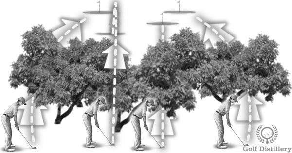
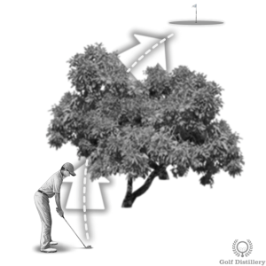
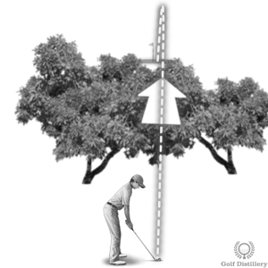

# Golf Tips on How to Hit Golf Shots from Tree Trouble

This section covers the shots that you will need to master if you are trying to limit the damage caused by trees standing in the way between your ball and the intended target.

---

## How to Hit a Punch Shot under Trees

Review our golf tips for what to do when you find yourself with trees in between the ball and the intended target. Specifically, review our tips on how to keep the ball low so that it doesn't fly into overhanging branches. You will also learn how not to let branches get in the way of your golf swing.

---

## How to Draw a Punch Shot

Drawing a punch shot is useful when you are trying to keep the ball low and want the ball to curve from right to left (for a right handed golfer). This shot is especially useful when you find yourself into the trees following a wayward golf drive.

---

## How to Fade a Punch Shot

Fading a punch shot is useful when you must keep the ball low – because of overhanging branches – and need the ball to curve from left to right (for a right handed golfer).

---

## How to Hit a High Golf Shot Over Trees

Finding yourself in a situation when there is a tall tree in front of you is not always the result of a bad previous shot. Indeed, some golf courses feature tall trees in the fairway, forcing you to be creative on your way to the green.
