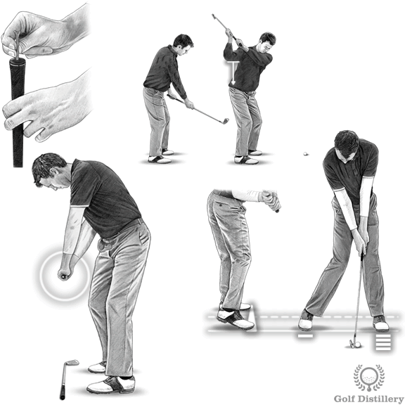

# Best Downswing Drills for your Golf Swing

## Overview

The downswing phase extends from the top of the swing through to impact with the ball. This critical phase determines ball flight, power, and consistency. Three key drills address common downswing errors.

## Drill 1: Weight Transfer Drill

**Purpose**: Transfer weight properly onto the front foot and avoid reverse pivot errors.

**Key Technique**:
- Push on right toes during downswing initiation
- This causes right heel to lift naturally
- Prevents weight from staying stuck on back foot

**Common Error Prevented**: Reverse pivot (weight remaining on back foot through impact)

## Drill 2: Correct Path Downswing Drill

**Purpose**: Verify club path alignment during the downswing sequence.

**Setup**:
- Insert a tee into the butt end of the grip
- Make normal swing with checkpoints

**Checkpoint 1 - Halfway Back**:
- Grip end should point toward the ball

**Checkpoint 2 - Downswing (shaft parallel to ground)**:
- Tee should point straight down the target line
- Indicates square swing path

**Benefits**: Visual feedback confirms proper club path throughout the swing.

## Drill 3: Anti Over-the-Top Drill

**Purpose**: Eliminate over-the-top swing errors causing outside-in swing paths.

**Setup**:
- Grip the shaft below the normal grip with right hand
- Take backswing to top position

**Key Focus**:
- Drop right elbow straight down toward right side of hips
- Prevents outside-in swing path
- Promotes inside-to-square club delivery

**Common Error Prevented**: Over-the-top (casting the club from outside)

---

**Source**: https://www.golfdistillery.com/drills/downswing-drills/

For complete detailed instructions and additional tips, visit the original page at Golf Distillery.
